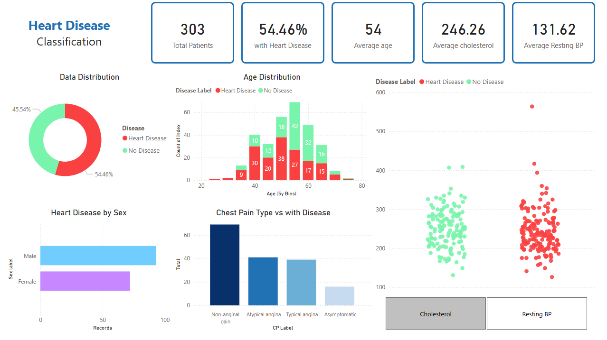

# Heart Disease Classification 

A compact, explainable project on the classic heart disease dataset that pairs a clean Power BI dashboard with machine learning to surface risk patterns and predictions.
--- 
## This project contains: 
- ML models with cross validated metrics, feature explanations and exploratory data analysis. 
- Power BI dashboard with clean KPIs, readable labels, and insights that tie features to clinical intuition (cholesterol, BP, chest pain). 

 
## Overview of insights from Dashboard 
- Postive and Negative cases: roughly even (slightly more positive cases), so rates are comparable across groups. 
- Age: cases cluster in the mid 40s to early 60s. 
- Sex: more male cases in absolute terms and the rates are shown so the comparison is fair. 
- Chest pain type (cp): Non-anginal pain tends to have higher disease rate, whereas the Asymptomatic pain has the lowest (in this sample). 
- Cholesterol & Resting BP: positive class skews higher in resting blood pressure. 

## Model performance: 
- Best performing classification model: K Nearest Neighbors 
- Accuracy: 81.9% 

## Why it matters? 
Interpretability first: clinical thresholds are visible on the charts; the model’s top drivers align with domain intuition. 
Usability: toggles, readable labels, and consistent colors make the dashboard intuitive for non technical audiences. 

## Limitations 
Small sample size (n=303) and hence is indicative in the results.
